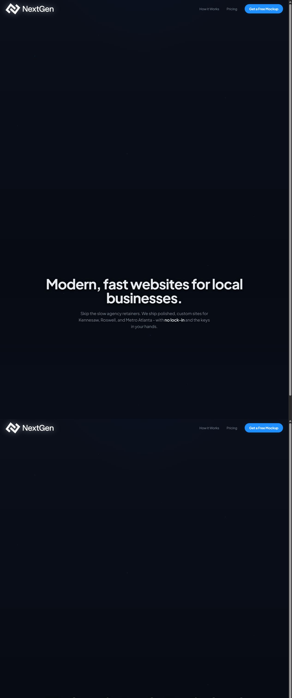

# NextGen Atlanta Showcase

NextGen Atlanta Showcase is a responsive agency site built to present digital services, explain pricing, capture qualified leads, and guide new clients through a structured onboarding workflow.

**Live site:** [nextgenatlanta.com](https://www.nextgenatlanta.com/)



[Watch the 75-second demo](docs/demo.mp4)

## Public portfolio edition

This repository is a lightweight, sanitized portfolio edition of the deployed site. It preserves the application structure, form boundaries, and serverless integrations while excluding deployment history, production identifiers, and the large AI-generated hero video.

The video remains live at `nextgenatlanta.com` and is intentionally not duplicated in Git history. As of August 25, 2026, the deployed page loads the autoplay/muted hero asset from the same production domain. This repository does not claim to be the deployment source of record.

## Highlights

- Responsive service, feature, pricing, and conversion sections
- Animated interactions with accessible reduced-motion behavior
- Lead capture and client onboarding forms
- Vercel Functions for server-side form handling
- Resend integration for transactional email delivery
- Server-side validation, length limits, and HTML escaping
- Security-conscious domain onboarding that never requests account passwords

## Architecture

| Area | Implementation |
| --- | --- |
| Frontend | React 18, TypeScript, Vite |
| UI | Tailwind CSS, Radix UI, Framer Motion |
| Forms | React Hook Form and Zod |
| Server endpoints | Vercel Functions |
| Email | Resend |

## Run locally

```bash
npm ci
cp .env.example .env
npm run dev
```

Set `RESEND_API_KEY` and `RESEND_FROM` when exercising the server endpoints. The Vite development server proxies `/api` requests to port 3000, where the functions can be run with the Vercel CLI.

## Quality checks

```bash
npm run lint
npm run build
```

The onboarding workflow accepts business and domain coordination details only. Registrar passwords, API keys, and other account credentials must be exchanged through an approved secure access process, never through these forms.

For a reviewer-friendly product tour, use the 75-second script in [`docs/demo-script.md`](docs/demo-script.md). The screenshot above was captured from the live site; do not submit the form while demoing unless you intend to send a real request.
